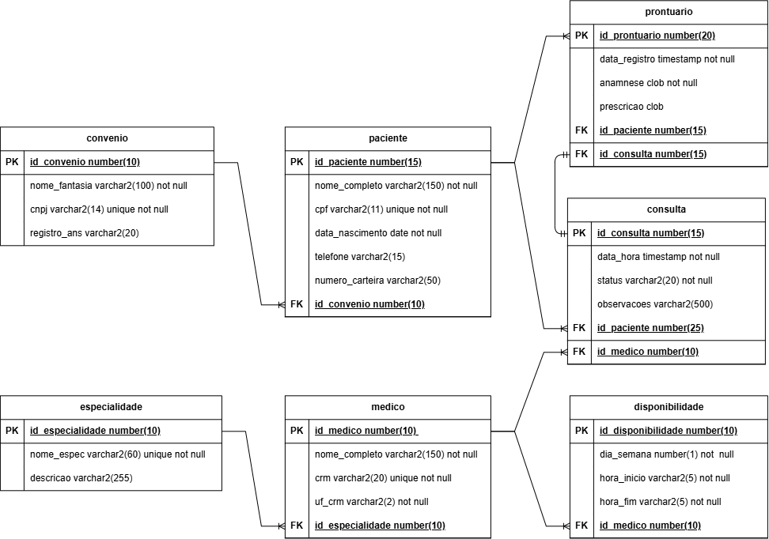
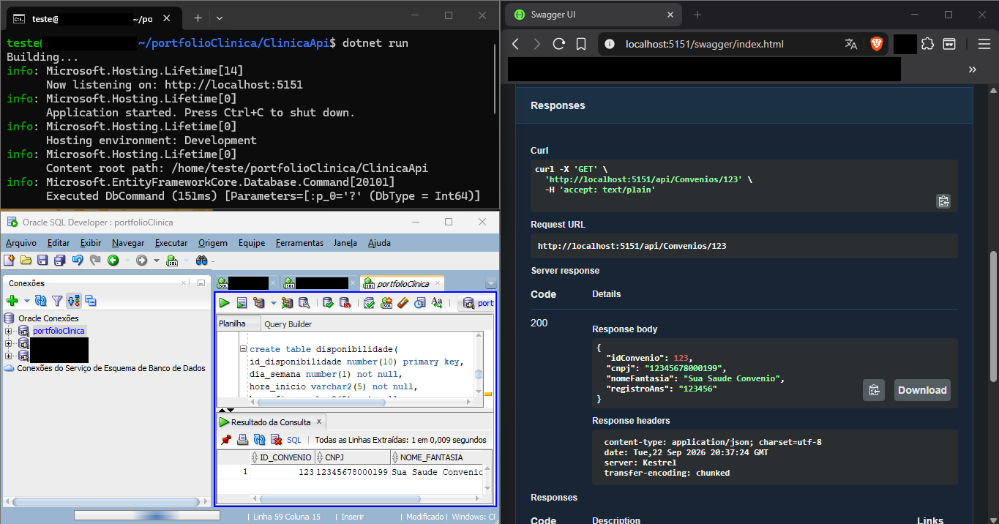
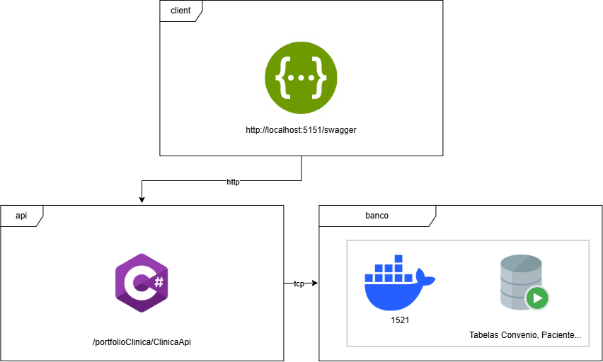

# 🚀 API de uma clinica médica utilizando C#, Oracle DB e Docker, com testes em Swegger

Este portfólio contém a demonstração de uma API de clinica médica em C# consultando o Oracle DB em um container Docker, iniciando o processo com requisições no Swagger,
focando na modelagem de um banco de dados bem próximo da realidade de uma produção.

---

## 📐 DER

## 🏛️ Decisões de Arquitetura (ADRs)

- Ubuntu Server 24.04 LTS como SO por sua estabilidade de longo prazo garantida
- Docker + Docker Compose para isolamento e padronização
- Oracle DB por sua confiança e suporte
- Swagger pela praticidade de testes de API Restfull
- C# pela sua larga documentação de APIs

## 🔍 Evidências de Funcionamento

- Teste do Swagger

- Diagrama da Arquitetura

